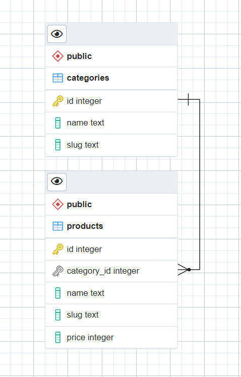

## Установка

```bash
# Клонируем приложение
git clone https://github.com/xzdwq/revoluterra-test.git
cd revoluterra-test
# Установка зависимостей backend
npm i
```

## Создание базы данных
В качестве базы данных использовалась PostgreSQL 14
```bash
host: locolhost
port: 5432
schema: public
```
Создать базу данных `revoluterra`  

## Миграция данных в базу данных
В проекте используется `Prisma ORM`  
После создания пустой БД необходимо сделать ранее созданные миграции запустив команду:  
```bash
npm run migrate:dev
```
<p align="center">
  
</p>

<details>
  <summary>Если нет миграций</summary>
  Если миграций нет (в `./prisma/` нет папки `migrations`), то необходимо их создать:  
  1. Опишите будущие таблицы в `./prisma/schema.prisma`  
  2. Проинициализируйте миграцию  
  ```bush
  npm run migrate:dev:create
  ```  
  (это создаст файл миграции, но не применит его)  
  3. Откройте созданный `migration.sql` файл из вновь созданной миграции (`./prisma/migrations/{num}_{name}/migration.sql`)  
  4. Допишите/измените свои исполняемые SQL запросы, например  
  ```bush
  INSERT INTO "Post" ("title", "content", "published", "authorId") VALUES
    ('test title', 'test text', true, 2);
  ```    
  5. Примените миграцию  
  ```bush
  npm run migrate:dev
  ```  
  6. В результате создадуться таблицы и вставятся данные в БД  
</details>

## Запуск приложения
Из корня приложения (./revoluterra-test)
```bash
npm run watch
```
Команда запустит backend.  
Обращение к API endpoints бэка будет доступно по запросу `localhost:3000/api/{:name}`  

## При создании новых (или изменении существующих) моделей GraphQL (`*.graphql`) необходимо сгенерировать типы данных командой:
```bash
npm run gen-typings
```
Команда ищет все `./**/*.graphql` файлы в проекте и описывает типы в `src/graphql.ts`  
После этого можно тестировать запросы по адресу:  
`localhost:3000/graphql`  
(Для проекта выбран `apollo-server-express` с его песочницей, т.к. он функциональнее песочницы graphql по умолчанию)  
Далее нажать `Query your server`  